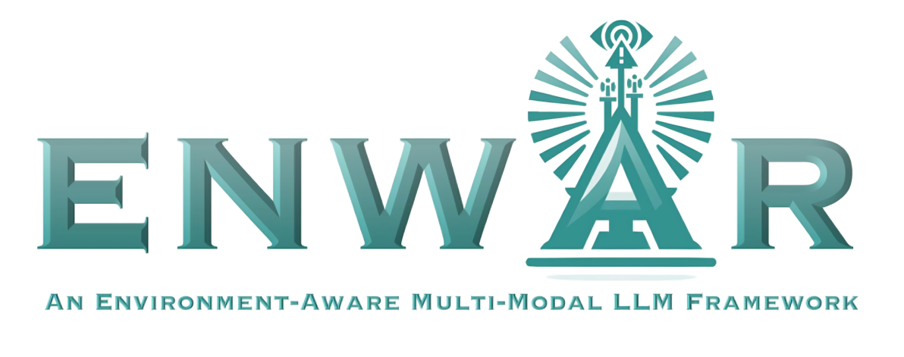

# Enwar1.0
<div style="text-align: center;">

</div>

## Overview
Enwar is an LLM framework that processes multi-modal inputs, transforms them into textual representations, and in parallel pipelines that data to a set of machine learning models to complete specific tasks. Within this scope, the data inputs are pushed to a perception agent and beam prediction agent.

This repository contains the code for setting up Enwar, preparing the datasets, training the beam prediction model, and setting up the perception agents.

## Abstract
Large language models (LLMs) hold significant promise in advancing network management and orchestration in sixth-generation (6G) and beyond networks. However, existing LLMs are limited in domain-specific knowledge and their ability to handle multi-modal sensory data, which is critical for real-time situational awareness in dynamic wireless environments. This paper addresses this gap by introducing Enwar, an **EN**vironment-a**WAR**e retrieval-augmented generation (RAG)-empowered multi-modal LLM framework. Enwar seamlessly integrates multi-modal sensory inputs to perceive, interpret, and cognitively process complex wireless environments to provide human-interpretable situational awareness. Enwar is evaluated on the global positioning system (GPS), light detection and ranging (LiDAR) sensors, and camera modality combinations of the DeepSense6G dataset with state-of-the-art LLMs such as Mistral-7b/8x7b and LLaMa3.1-8/70/405b. Compared to general and often superficial environmental descriptions of these vanilla LLMs, Enwar delivers richer spatial analysis, accurately identifies positions, analyzes obstacles, and assesses line-of-sight (LoS) between vehicles. Results show that Enwar achieves key performance indicators of up to 70% relevancy, 55% context recall, 80% correctness, and 86% faithfulness, demonstrating its efficacy in multi-modal perception and interpretation. 

## Directory Descriptions

### Main Directory

This set of files pertains to the implementation of Enwar 1.0 which is within a V2V scenario [DeepSense6G Scenarios 36-39](https://www.deepsense6g.net/scenarios36-39/), and contains ground truth explanations in the samples.

* ```camera_detect_im2text.py```: contains helpers to call LLaMa3.2-11b Vision to create a textual description of an image through an instructional prompt

* ```generate_prompt.py```: contains Enwar 1.0's prompt generation helper. The prompt generation code is used to feed to an LLM to get ground truth explanations, which will be edited and reviewed by human-in-the-loop, and then appended to teh final dataset to be using in the **environment-sensing-dataset** directory.

* ```main.py```: contains the main code which implements Enwar 1.0

* ```RAG.py```: contains helper functions for retrieval-augmented generation

* ```util.py```: contains various helpers for miscallaneous tasks such as distance estimation and file loading.

* **environment-sensing-dataset**: contains samples of perceived data in textual description for various samples
* **evaluate:**
    * ```evaluator.ipynb```: evaluates various LLMs with ground truth Q\&A samples in the files, but uses RAGAS which requires an OpenAI key
* **LiDAR-Detection**: contains the setup for pretrained SFA-3D, follow the directions on [SFA-3D GitHub](https://github.com/maudzung/SFA3D/tree/master) for the setup

## Citation
To cite Enwar, please add the following citation below, or add the latest citation from [IEEE Xplore](http://www.google.com)

```
@misc{nazar2024enwarragempoweredmultimodalllm,
      title={ENWAR: A RAG-empowered Multi-Modal LLM Framework for Wireless Environment Perception}, 
      author={Ahmad M. Nazar and Abdulkadir Celik and Mohamed Y. Selim and Asmaa Abdallah and Daji Qiao and Ahmed M. Eltawil},
      year={2024},
      eprint={2410.18104},
      archivePrefix={arXiv},
      primaryClass={cs.NI},
      url={https://arxiv.org/abs/2410.18104}, 
}
```

## Fun Fact
Enwar is a common name in Turkic and Arabic cultures, meaning more enlightened, insightful, and intellectual; herein referring to a multi-modal LLM providing deep situational and contextual insights into the environment.